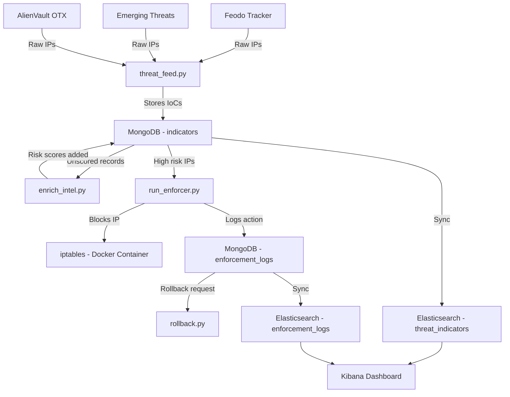

# Advanced Threat Intelligence Platform (TIP) & Dynamic Policy Enforcer

> **Finance & Banking Cybersecurity Internship Project**  
> Author: Ansh | Started: 21 May 2026

---

## Overview

The **Advanced Threat Intelligence Platform (TIP)** is a fully automated cybersecurity pipeline that ingests, enriches, enforces, and visualizes threat intelligence from multiple OSINT sources. It simulates a real-world SOC (Security Operations Center) environment with automated IP blocking, analyst rollback capability, and a live Kibana dashboard.

---

## Features

- **Multi-Source OSINT Ingestion** — Feodo Tracker, Emerging Threats, AlienVault OTX
- **Automated Risk Scoring** — Every indicator scored and classified by severity
- **Dynamic Policy Enforcement** — Auto-blocks high-risk IPs (score ≥ 8.0) via iptables (Docker/Linux)
- **SOC Analyst Rollback** — Reverse any block with full audit trail
- **Elasticsearch Integration** — All indicators and enforcement logs synced with enriched fields
- **Kibana Dashboard** — Live visualizations: Threats by Source, Risk Score distribution, Blocked IPs log, Total Threats, High Risk Threats
- **Persistent Audit Logging** — Every enforcement action logged to MongoDB and Elasticsearch

---

## Technology Stack

| Component | Technology |
|---|---|
| Core Language | Python 3.x |
| Database | MongoDB (Docker) |
| Search & Analytics | Elasticsearch 7.17.10 (Docker) |
| Visualization | Kibana 7.17.10 (Docker) |
| Policy Enforcement | iptables via Linux Docker container |
| Container Orchestration | Docker Compose |
| CI/CD | GitHub Actions |
| OSINT Feeds | Feodo Tracker, Emerging Threats, AlienVault OTX |

---

## System Architecture



---

## Project Structure

```
advanced-threat-intelligence-platform/
├── scripts/
│   ├── threat_feed.py        # Scrapes 3 OSINT feeds into MongoDB
│   ├── enrich_intel.py       # Risk scores all indicators
│   ├── sync_to_elastic.py    # Pushes MongoDB data to Elasticsearch
│   ├── run_enforcer.py       # Blocks high-risk IPs, writes enforcement_logs
│   ├── rollback.py           # SOC analyst tool to reverse blocks
│   ├── policy_enforcer.py    # Docker version of enforcer
│   ├── view_data.py          # Shows sample MongoDB records
│   ├── check_logs.py         # Shows enforcement_logs collection
│   ├── check_scores.py       # Shows risk score stats
│   └── reset_blocked.py      # Resets blocked flags for testing
├── data/
├── logs/
├── docs/
│   └── progress_log.md
├── .github/workflows/
│   └── security-scan.yml
├── docker-compose.yml
├── Dockerfile.enforcer
├── requirements.txt
├── .env.example
└── README.md
```

---

## Setup & Installation

### Prerequisites
- Docker Desktop
- Python 3.x
- Git

### 1. Clone the Repository

```bash
git clone https://github.com/Apart004/advanced-threat-intelligence-platform.git
cd advanced-threat-intelligence-platform
```

### 2. Configure Environment

```bash
cp .env.example .env
# Edit .env and add your OTX_API_KEY
```

### 3. Start Docker Containers

```bash
docker-compose up -d
```

### 4. Install Python Dependencies

```bash
pip install -r requirements.txt
```

---

## Running the Pipeline

Run each step in order:

```bash
# Step 1: Ingest threat feeds
python scripts/threat_feed.py

# Step 2: Enrich with risk scores
python scripts/enrich_intel.py

# Step 3: Enforce policy (block high-risk IPs)
python scripts/run_enforcer.py

# Step 4: Sync to Elasticsearch
python scripts/sync_to_elastic.py

# Step 5: View Kibana dashboard at http://localhost:5601
```

---

## Kibana Dashboard

Open **http://localhost:5601** and navigate to **Threat Intelligence Overview** dashboard.

| Panel | Description |
|---|---|
| Threats by Source | Pie chart showing IoC distribution by feed |
| Threats by Risk Score | Bar chart of risk score distribution |
| Blocked IPs Log | Table of all blocked IPs with scores |
| Total Threats | Total indicator count (825+) |
| High Risk Threats | Count of IPs scoring ≥ 8.0 |

---

## Risk Scoring

| Score | Severity | Source |
|---|---|---|
| 9.0 | Critical | Feodo Tracker |
| 8.0 | High | AlienVault OTX |
| 6.0 | Medium | Emerging Threats |

Threshold for auto-blocking: **≥ 8.0**

---

## SOC Rollback

To reverse a block on an IP:

```bash
python scripts/rollback.py
```

The rollback is logged in `enforcement_logs` with `rolled_back: true` and `blocked_status: Rolled Back`.

---

## Environment Variables

See `.env.example` for all required variables:

```
MONGO_URI=mongodb://localhost:27017/
DB_NAME=threat_intel_db
COLLECTION_NAME=indicators
ES_HOST=http://localhost:9200
ES_INDEX=threat_indicators
OTX_API_KEY=your_otx_api_key_here
RISK_THRESHOLD=8.0
```

---

## Current Stats

- **825+** threat indicators ingested
- **3** OSINT feed sources
- **5** high-risk IPs identified and blocked
- **5** enforcement log entries with severity labels
- **2** Elasticsearch indices
- **5** Kibana dashboard panels

---

*Focusing on Security Automation, Threat Intelligence Engineering & Defensive Operations.*