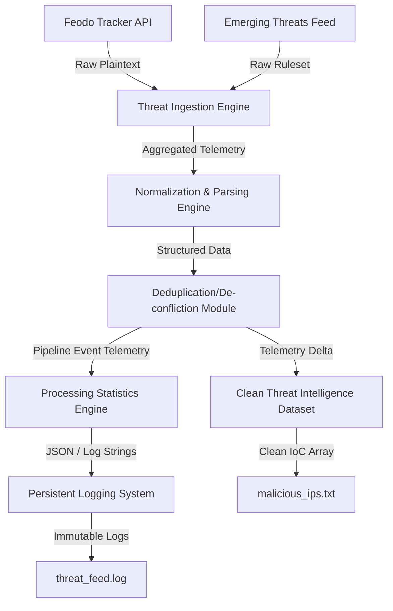

# Advanced Threat Intelligence Platform (TIP)

## 📌 Overview
The **Advanced Threat Intelligence Platform (TIP)** is an automated cybersecurity pipeline engineered to ingest, process, and normalize Indicators of Compromise (IoCs) from multiple disparate open-source intelligence (OSINT) feeds. 

The platform aggregates raw malicious IP datasets, executes data normalization schemas, filters out duplicate threats, computes algorithmic processing statistics, and maintains an immutable persistent execution log for forensic auditing and SIEM integration readiness.

---

## ⚡ Features
* **Multi-Source Ingestion:** Automated ingestion vectors targeting highly reputable OSINT infrastructure (`Feodo Tracker`, `Emerging Threats`).
* **Data Normalization & Sanitization:** Structural parsing of unstructured plain-text/CSV threat feeds into uniform, structured formats.
* **High-Performance Deduplication:** Streamlined filtering to eliminate redundant data points across overlapping threat intelligence providers.
* **Granular Metrics Generation:** Real-time extraction of pipeline processing statistics (Total ingestion counts, dropped duplicates, final telemetry delta).
* **Persistent Auditing & Logging:** Comprehensive execution trail tracking network errors, ingestion timestamps, and pipeline health statuses.

---

## 🛠️ Technology Stack & Tools
* **Core Engine:** Python 3.x
* **Network Transport:** Requests Library
* **Version Control & CI/CD:** Git & GitHub Actions
* **Ingestion Targets:** Emerging Threats IP Blocklist, Abuse.ch Feodo Tracker
* **Target Environments:** Cross-platform compatibility (Linux / Windows PowerShell)

---

## 🗺️ System Architecture



---

## 📂 File Topology

```text
advanced-threat-intelligence-platform/
│
├── data/
│   └── malicious_ips.txt       # Clean, deduplicated Threat Intelligence Dataset
│
├── logs/
│   └── threat_feed.log         # Persistent execution logs for auditing & SIEM
│
├── scripts/
│   └── threat_feed.py          # Core pipeline orchestration logic
│
├── docs/                       # Architecture diagrams and design notes
└── README.md

```

---

## 🚀 Deployment & Usage

### 1. Clone the Repository

```bash
git clone [https://github.com/Apart004/advanced-threat-intelligence-platform.git](https://github.com/Apart004/advanced-threat-intelligence-platform.git)
cd advanced-threat-intelligence-platform

```

### 2. Environment Configuration

Ensure you have your dependencies provisioned:

```bash
python -m pip install requests

```

### 3. Execute the Intelligence Pipeline

```bash
python scripts/threat_feed.py

```

---

## 📊 Telemetry & Outputs

### Console Runtime Output

```text
[-] Ingesting feed: [https://feodotracker.abuse.ch/downloads/ipblocklist.txt](https://feodotracker.abuse.ch/downloads/ipblocklist.txt)
[-] Ingesting feed: [https://rules.emergingthreats.net/blockrules/compromised-ips.txt](https://rules.emergingthreats.net/blockrules/compromised-ips.txt)

[+] Ingestion pipeline synchronization successful.

[=] Aggregated Raw Records: 521
[=] Deduplicated Delta: 0
[+] Final Actionable IoCs Cached: 521

```

### Normalized IoC Schema Sample

```json
{
    "malicious_ip": "162.243.103.246",
    "source": "OSINT Threat Feed",
    "status": "malicious",
    "identified_at": "2026-05-25T01:28:40Z"
}

```

### Persistent Audit Trail Log Sample

```text
[2026-05-25 01:28:39] INFO: Successfully downloaded feed: [https://feodotracker.abuse.ch/downloads/ipblocklist.txt](https://feodotracker.abuse.ch/downloads/ipblocklist.txt)
[2026-05-25 01:28:40] INFO: Deduplication processing completed. Total unique records remaining: 521
[2026-05-25 01:28:40] SUCCESS: Threat intelligence ingestion pipeline run finished.

```

---

## 🛡️ Core Cybersecurity Implementations

* **OSINT Intelligence Engineering:** Hands-on lifecycle experience working with active tactical cyber threat data indicators.
* **Data Aggregation Protocols:** Parsing diverse external communication lines into a single single-source-of-truth datastore.
* **Defensive Security Logging Frameworks:** Constructing standardized application execution outputs that mimic enterprise SIEM ingest targets.
* **Security Process Automation:** Eradicating manual intelligence collection methods through scripted defensive logic routines.

---

## 🔮 Future Engineering Backlog

* [ ] **Database Layer Integration:** Transitioning local flat-file flat caching to a structured MongoDB/PostgreSQL cluster.
* [ ] **Algorithmic Threat Severity Scoring:** Calculating contextual risk metrics using asset tracking APIs.
* [ ] **Active Infrastructure Defense:** Developing an automated extension script to export blocks directly to local Firewalls (iptables/pfSense API).
* [ ] **Enrichment Services:** Introducing passive WHOIS extraction and Geolocation intelligence queries via external APIs.

---

**Author:** Ansh

*Focusing on Security Automation, Threat Intelligence Engineering, & Defensive Operations.*

```
Started 21May 2026
```
